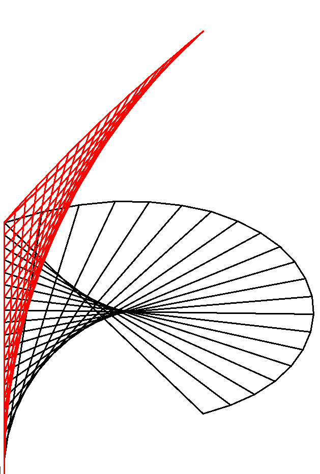

# parabola_from_envelope

Art created by drawing a parabola using the envelope of a simple sequence of straight lines.

Drawn using Python turtle.

## Usage:

```
./parabola_from_envelope.py --help
```

Alternative
```
python3 parabola_from_envelope.py --help
```

## Samples





